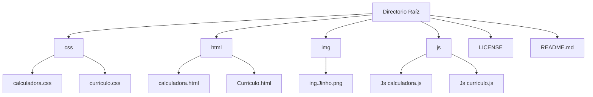

# Parcial_2-INTRODUCCI-N-A-LOS-LENGUAJES-DE-INTERNET

---

## Descripción General

Este proyecto incluye el desarrollo de dos aplicaciones web orientadas a la práctica de diseño frontend y lógica funcional:

Página Web Personal:
    Una interfaz moderna y adaptable que presenta el perfil profesional. La página contiene información personal, habilidades y experiencia laboral, integrando un diseño responsive y una funcionalidad para alternar entre temas claro y oscuro, mejorando la experiencia del usuario en distintos entornos de visualización.

Calculadora Web:
    Una herramienta sencilla pero robusta que permite realizar las operaciones aritméticas básicas: suma, resta, multiplicación y división. La calculadora cuenta con una interfaz profesional y amigable, gestionando correctamente excepciones como la división entre cero.

Ambos proyectos están diseñados con enfoque en la usabilidad, estética y buenas prácticas de desarrollo web.

Esto es un curriculo junto a una calculadora basica usando HTML Css y JavaScrip puro

